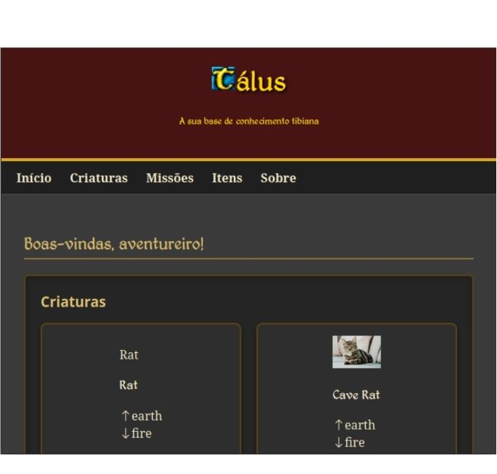

# álus
base de conhecimento de Tibia

### About
Projeto da imersão Dev Google da Alura. Trata-se de uma base de conhecimento do jogo online [Tibia](https://www.tibia.com), desenvolvido pela [CipSoft](https://www.cipsoft.com).
Aqui existem informações sobre:
 - 🐲 Criaturas
 - 📋 Missões
 - 🔨 Itens

### Author
[Demócrito d'Anunciação](http://github.com/democrito88)